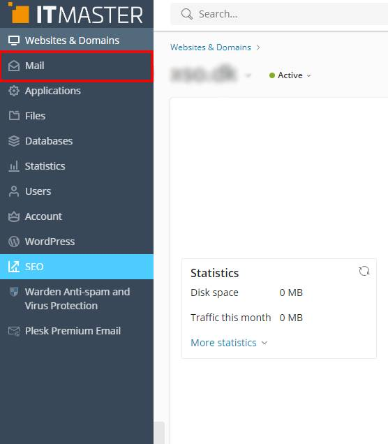
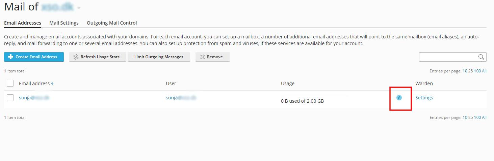
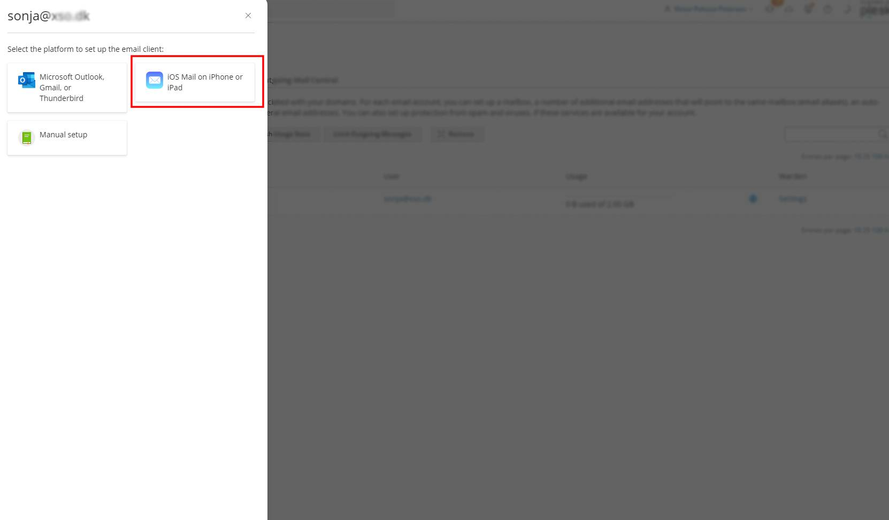
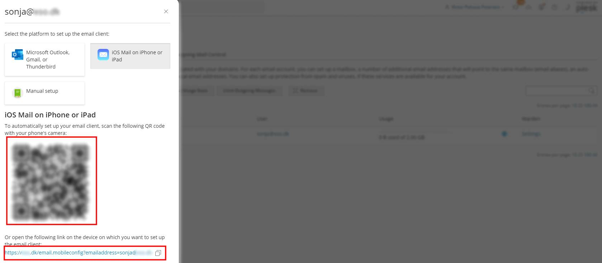

# Guide til automatisk opsætning af mail på IOS og MAC OS
Denne artikel er udarbejdet for ITMASTER ApS, Bødkervej 1, 6710 Esbjerg V.

### 1. Login i kontrolpanelet

Du kan login i kontrolpanelet via nedenstående link, hvor du skal indtaste dit udleveret login.

 [Direkte link til kontrolpanel](https://web1.itmaster.net/)

### 2. Klik på mail i menuen

### 3. Klik på det blå info ikon, ud for din mail konto

### 4. Tryk på "IOS Mail on iPhone or iPad"

### 5. Download konfigurationen

Du kan vælge mellem 2 forskellige, måder at downloade konfiguraionen på.

<ul>
    <li>
    Scan QR Koden fra en mobil eller ipad, for at download IOS/MAC profilen.
    </li>
    <li>
    Klik på linket i bunden, på din IOS/MAC device, for at downloade profilen.
    </li>
</ul>

